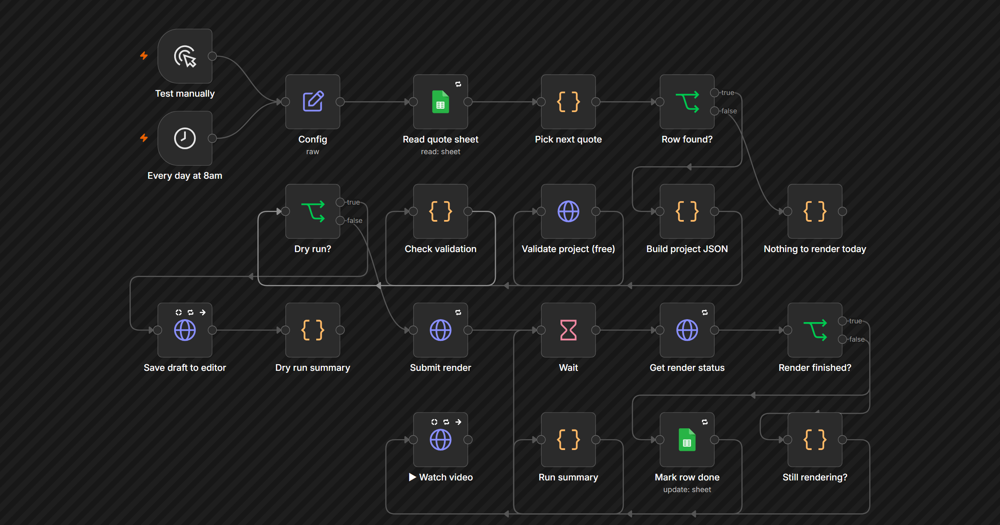
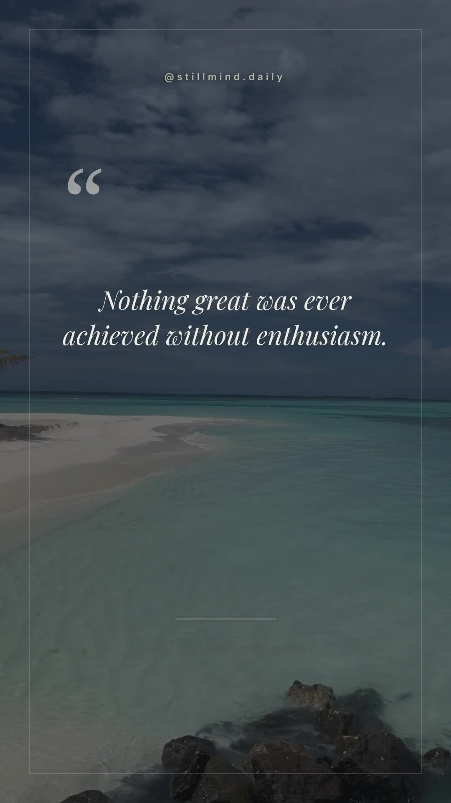

# n8n Google Sheets daily motivational quote video automation

Turn a Google Sheet of quotes into **one polished vertical video per day** with
n8n and the Zvid video API. The workflow reads the first pending row, renders a
1080×1920 motivational Reel, writes `done` and the finished MP4 URL back to that
exact row, then lets you watch the video inside n8n.

[](n8n/zvid-daily-quote-reels.workflow.json)

This example is ready for Instagram Reels, YouTube Shorts, TikTok videos, daily
quote pages, faceless content channels, and other scheduled video-automation
workflows. It uses n8n core nodes only, so it imports on n8n Cloud or a
self-hosted n8n instance without installing a community package.

## Output example

[](example.mp4)

**[Watch or download the complete MP4 output](example.mp4)**

The checked-in example was rendered from the first row in
[`data/quotes.csv`](data/quotes.csv) with the deterministic sample date
`2026-07-28`:

- 1080×1920 MP4 at 30 fps
- 10.8 seconds
- 11 render credits
- two scenes: quote over moving footage, then author and call-to-action card
- source project: [`example-project.json`](example-project.json)

## What the workflow does

```text
Every day at 8am
  → Read quote sheet
  → Pick the first row with an empty Status
  → Build an adaptive vertical video project
  → Validate the project for free
  → Render or save a dry-run draft
  → Poll until the MP4 is ready
  → Write done + VideoUrl to the same Sheet row
  → Watch the finished video inside n8n
```

The design rotates through five background-and-music pairings by day of year.
Consecutive days use different looks, while rerunning the same date produces the
same result. Quote typography scales from 62 px to 42 px as copy gets longer,
and author names scale independently for the end card.

## Quick start: n8n + Google Sheets

1. Download and import
   [`n8n/zvid-daily-quote-reels.workflow.json`](n8n/zvid-daily-quote-reels.workflow.json)
   into n8n.
2. Import [`data/quotes.csv`](data/quotes.csv) into Google Sheets. Keep the tab's
   header row exactly as supplied:

   ```text
   Quote | Author | AuthorNote | Status | VideoUrl
   ```

3. Create a Zvid API key at
   [https://app.zvid.io/api-keys](https://app.zvid.io/api-keys).
4. In n8n, create a **Header Auth** credential with header name `x-api-key` and
   your Zvid key as the value. Attach it to:
   - **Validate project (free)**
   - **Save draft to editor**
   - **Submit render**
   - **Get render status**
5. Attach your Google Sheets credential to **Read quote sheet** and
   **Mark row done**, then select the same spreadsheet and tab in both nodes.
6. Open **Config** and change `channelName` and `ctaText` for your brand.
7. For a free first test, set `dryRun: true`. The workflow validates the exact
   project, reports the credit cost, and saves a draft that opens in the
   [Zvid visual editor](https://editor.zvid.io). It spends no credits and does
   not update the Sheet.
8. Set `dryRun: false` to render for real. The default short quote costs about
   11 credits. Activate the workflow when you are ready for the daily schedule.

See [`n8n/README.md`](n8n/README.md) for node-by-node setup and troubleshooting.

## Run the same design from Node.js

The CLI uses the CSV as a local stand-in for Google Sheets. It loads the exact
project-builder function embedded in the n8n workflow, so the no-code and code
paths cannot drift into different designs.

```bash
npm install
cp .env.example .env
# Add a key from https://app.zvid.io/api-keys to .env

npm run check       # local structural/data validation
npm run dry-run     # free remote validation + editor draft
npm run sample      # real deterministic render; spends about 11 credits
npm start           # real render using today's background rotation
```

Each real CLI run consumes the first empty-`Status` row only. It writes these
artifacts to `out/`:

| File | Purpose |
| --- | --- |
| `project.json` | Exact Zvid project sent to validation and rendering. |
| `result.json` | Job ID, CDN URL, credits, duration, background, and Sheet row. |
| `quotes.csv` | Queue copy with the processed row marked `done` and its `VideoUrl`. |
| `daily-quote-*.mp4` | Downloaded output video, unless `--no-download` is used. |

Run `node src/index.js --help` for data, date, output, polling, timeout, and
download options.

## Google Sheet schema

| Column | Required | Purpose |
| --- | --- | --- |
| `Quote` | Yes | Main quote text. |
| `Author` | Yes | Attribution shown on both scenes. |
| `AuthorNote` | No | Small supporting line under the author name. |
| `Status` | No | Leave empty for pending rows; the workflow writes `done`. Any manual value skips the row. |
| `VideoUrl` | No | Leave empty; the finished MP4 URL is written here. |

The workflow always selects the first empty-`Status` row from top to bottom.
Do not sort or delete rows while a run is in progress because the captured
Google Sheets `row_number` could point at a different row.

## Sample quote sources

The three sample rows use quotations from the authors' published works rather
than placeholder bylines:

- Ralph Waldo Emerson, [*Essays, First Series*](https://www.gutenberg.org/cache/epub/2944/pg2944-images.html)
- Booker T. Washington, [*Up from Slavery*](https://www.gutenberg.org/cache/epub/2376/pg2376-images.html)
- Helen Keller, [*Optimism*](https://www.gutenberg.org/files/31622/31622-h/31622-h.htm)

## Project layout

| Path | Purpose |
| --- | --- |
| [`n8n/zvid-daily-quote-reels.workflow.json`](n8n/zvid-daily-quote-reels.workflow.json) | Ready-to-import core-node n8n workflow. |
| [`data/quotes.csv`](data/quotes.csv) | Three-row Google Sheets-ready queue example. |
| [`config.json`](config.json) | Channel, typography, color, media-rotation, and polling settings for the CLI. |
| [`src/index.js`](src/index.js) | Pick row → build → validate → render → poll → download → update queue. |
| [`src/project.js`](src/project.js) | Loads the canonical builder from the workflow JSON. |
| [`src/queue.js`](src/queue.js) | Exact Sheet/CSV schema and first-pending-row logic. |
| [`package.json`](package.json) | Installs `@zvid/sdk`, the official API client with retry handling. |
| [`example-project.json`](example-project.json) | Project used for the checked-in MP4. |
| [`example-poster.jpg`](example-poster.jpg) | Representative frame and clickable README preview. |
| [`example.mp4`](example.mp4) | Real rendered output example. |

## Production notes

- The shipped workflow renders for real by default. Use `dryRun: true` before
  the first paid run if you want the exact price and an editor preview.
- A failed render leaves the Sheet row pending so the next run can retry it.
- Back-to-back manual renders can hit an account's hourly limit. A single daily
  scheduled run normally avoids that pattern.
- Check the n8n instance timezone before relying on the 8am schedule.
- The required workflow ends with a public MP4 URL; automatic publishing is an
  optional extension and is not included in this repository.
- Background footage and music come through Zvid's stock library, so no
  separate media-library account is required.

## Links

- [n8n video automation workflow templates](https://zvid.io/n8n-workflows)
- [Zvid video API documentation](https://docs.zvid.io)
- [Create a Zvid API key](https://app.zvid.io/api-keys)
- [Open the Zvid visual editor](https://editor.zvid.io)
- [Zvid website](https://zvid.io)

## License

MIT
